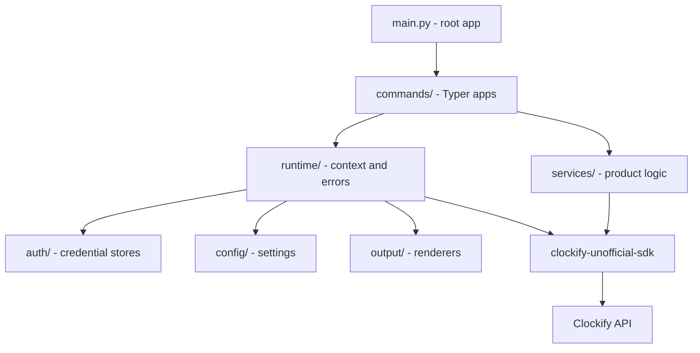

# Clockify Unofficial CLI

[](https://github.com/gajaguar/clockify-cli/actions/workflows/ci.yml)
[](LICENSE)
[](pyproject.toml)
[](https://github.com/gajaguar/clockify-cli)

> **Unofficial.** This project is not affiliated with, endorsed by, or
> supported by CAKE.com d.o.o. "Clockify" is a trademark of CAKE.com d.o.o.

Unofficial command-line interface for Clockify, built on
[`clockify-unofficial-sdk`](https://github.com/gajaguar/clockify-sdk).

## Table of contents

- [About](#about)
- [Key features](#key-features)
- [Architecture](#architecture)
- [Getting started](#getting-started)
  - [Prerequisites](#prerequisites)
  - [Installation](#installation)
- [Usage](#usage)
  - [Commands](#commands)
  - [Global options](#global-options)
  - [Exit codes](#exit-codes)
- [Configuration](#configuration)
- [Development](#development)
- [Platform notes](#platform-notes)
- [Roadmap](#roadmap)
- [Open items](#open-items)
- [Contributing](#contributing)
- [Security](#security)
- [License](#license)

## About

`clockify` provides a terminal and scripting interface to Clockify. The CLI
handles profiles, credential storage, name-to-ID resolution, output formatting,
and stable exit codes. The SDK owns HTTP, retries, pagination, typed models,
and API error mapping.

The CLI is being delivered in phases. The authoritative endpoint mapping is in
[`docs/coverage.md`](docs/coverage.md), and the delivery plan is in
[`docs/ROADMAP.md`](docs/ROADMAP.md).

## Key features

- **Profile-based configuration** - Store region, workspace, and user metadata
  per profile.
- **Safe authentication** - Validate keys before storage and use the OS
  keyring by default.
- **Script-friendly output** - Render data as `table`, `json`, `jsonl`, `csv`,
  or one identifier per line with `id`.
- **Stable automation contract** - Keep data on stdout, diagnostics on stderr,
  and use documented exit codes.
- **CI support** - Use `CLOCKIFY_API_KEY` without writing a credential to disk.
- **Typed API foundation** - Build on the SDK's typed models, retries, and
  pagination instead of making HTTP requests in the CLI.

## Architecture

The CLI is a thin product layer over the SDK. Commands use services and
runtime components for application context, credentials, configuration, output,
and error handling.



Read [`docs/ARCHITECTURE.md`](docs/ARCHITECTURE.md) for the full design,
security model, command conventions, and extension checklist.

## Getting started

### Prerequisites

- Python 3.14 or later
- A Clockify personal API key from **Profile settings -> API**
- [mise](https://mise.jdx.dev) for development from a repository checkout

Clockify does not provide OAuth2 for personal API access. The CLI uses a
personal API key and supports regional profiles.

### Installation

The CLI is not published to PyPI. Install it from a checkout:

```bash
git clone https://github.com/gajaguar/clockify-cli.git
cd clockify-cli
make install
```

`make install` installs the pinned toolchain, Python dependencies, Node-based
documentation tools, and the pre-commit hook.

## Usage

Log in interactively. The key is read from a hidden prompt, validated with
Clockify, and stored in the OS keyring:

```bash
clockify auth login
clockify auth status
```

Use standard input for CI or other non-interactive environments. Global
options must come before the command:

```bash
export CLOCKIFY_API_KEY=...
clockify -o json auth status | jq .email
printf '%s' "$KEY" | clockify -p work auth login --with-token --region EU_CENTRAL_1
```

### Commands

- `auth login [--region] [--with-token] [--insecure-storage]` validates and
  stores an API key.
- `auth status` shows the user, workspace, and credential source.
- `auth logout` removes the stored key and profile.
- `auth token` prints the raw key when explicitly requested.
- `config path` prints the settings file location.
- `config list` lists configured profiles.
- `config use NAME` sets the default profile.

Resource commands arrive in phases. See the
[roadmap](docs/ROADMAP.md) and [coverage matrix](docs/coverage.md) for their
status.

### Global options

- `-p, --profile`: select a stored profile. Environment variable:
  `CLOCKIFY_PROFILE`.
- `-w, --workspace`: override the profile's workspace. Environment variable:
  `CLOCKIFY_WORKSPACE`.
- `-o, --output`: select `table`, `json`, `jsonl`, `csv`, or `id`. Environment
  variable: `CLOCKIFY_OUTPUT`.
- `--version`: print the installed version.

### Exit codes

Exit codes are stable for shell scripts:

- `0`: success.
- `1`: unexpected failure.
- `2`: invalid usage.
- `3`: configuration error.
- `4`: authentication failure.
- `5`: forbidden.
- `6`: resource not found.
- `7`: validation failure.
- `8`: rate limited.
- `9`: service unavailable.

## Configuration

The settings file is stored in the platform-specific configuration directory.
Run `clockify config path` to locate it. On Linux, the default is usually
`~/.config/clockify-cli/config.toml`.

- `CLOCKIFY_API_KEY`: read-only credential source for automation.
- `CLOCKIFY_PROFILE`: select the active profile.
- `CLOCKIFY_WORKSPACE`: override the profile's workspace.
- `CLOCKIFY_OUTPUT`: select the default output format.
- `CLOCKIFY_CLI_CONFIG_DIR`: override the configuration directory.
- `CLOCKIFY_TEST_API_KEY`: enable live test authentication.

Credential resolution uses environment, then the OS keyring, then the
opt-in plaintext fallback. The fallback requires
`auth login --insecure-storage` and writes a file with `0600` permissions.

## Development

Run these commands from the repository root:

```bash
make install          # toolchain, dependencies, and git hooks
make check            # read-only quality gate
make fix              # apply safe automated fixes
make test             # pytest with a 90% coverage floor
make openapi-fetch    # download Clockify's OpenAPI document
make coverage-report  # compare coverage.md with the OpenAPI document
```

Use `make help` for every target. Most targets accept `FILES="..."` to limit
their scope, for example:

```bash
make md-lint FILES="README.md"
```

Live tests are excluded from `make test`. They require
`CLOCKIFY_TEST_API_KEY` and a test workspace.

## Platform notes

- Headless Linux hosts may not provide a Secret Service keyring backend. Use
  `CLOCKIFY_API_KEY` or the explicit `--insecure-storage` fallback.
- The SDK is a `uv` git dependency pinned to a tag, so installation requires
  access to GitHub.
- Python 3.14 is the minimum version required by the CLI and SDK.

## Roadmap

- [x] Phase 0: foundation, authentication, profiles, renderers, and exit codes
- [ ] Phase 1: workspace, user, project, task, tag, group, and entry commands
- [ ] Phase 2: core API completion
- [ ] Phase 3: reports
- [ ] Phase 4: time off, holidays, and approvals
- [ ] Phase 5: expenses and invoices
- [ ] Phase 6: scheduling, webhooks, and entity changes
- [ ] Phase 7: release hardening for `1.0.0`

See [`docs/ROADMAP.md`](docs/ROADMAP.md) for operation counts, dependencies,
and completion criteria.

## Open items

- Only the `GLOBAL` region host is verified against a live account.
- Plan-gated endpoints need a paid workspace for live verification.
- Clockify's per-plan rate limits are not fully documented upstream.

## Contributing

1. Fork the repository and create a feature branch.
2. Run `mise install && make install` to set up the toolchain.
3. Follow the command and testing checklist in
   [`docs/ARCHITECTURE.md`](docs/ARCHITECTURE.md).
4. Run `make check && make test` before committing.
5. Open a pull request describing the change and its endpoint coverage.

Read [`AGENTS.md`](AGENTS.md) for repository workflow rules.

## Security

Report suspected vulnerabilities to <dev@gajaguar.com> instead of opening a
public issue. A Clockify API key grants access to a workspace. Never commit a
key, and rotate it immediately if it is exposed.

## License

Distributed under the MIT License. See [`LICENSE`](LICENSE) for details.
