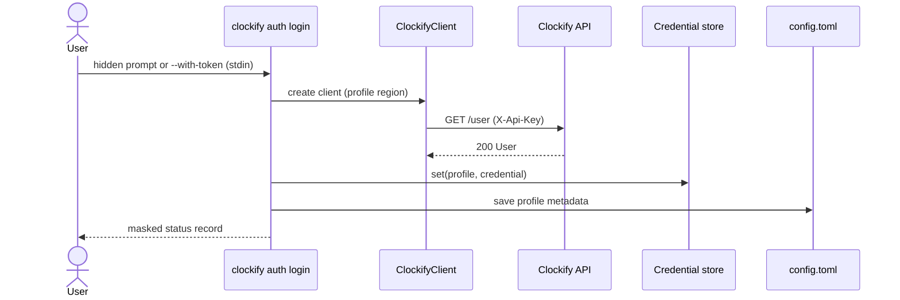
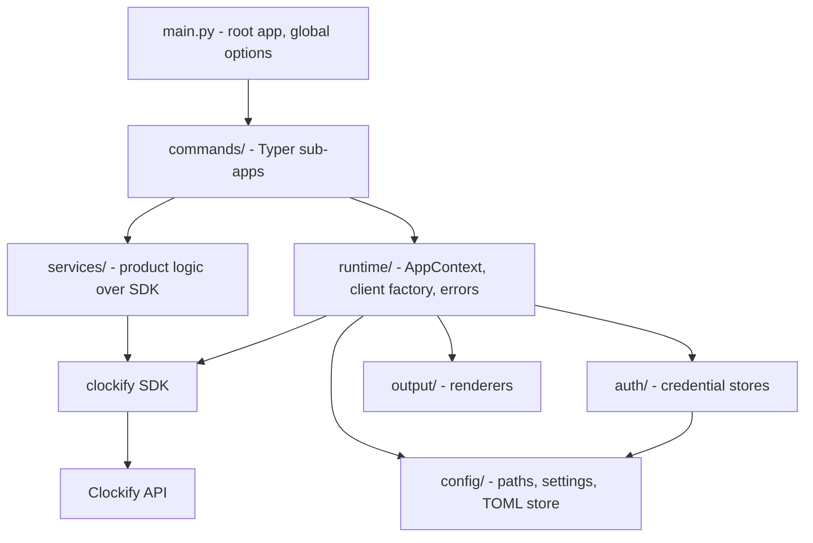

# Architecture and technical specification

This document is the technical specification for `clockify-cli`: what it is,
which stack and design patterns it uses and why, how authentication works,
and how to extend it. The phased delivery plan lives in
[`ROADMAP.md`](ROADMAP.md); the per-endpoint status lives in
[`coverage.md`](coverage.md).

## Table of contents

- [Purpose and scope](#purpose-and-scope)
- [Stack](#stack)
- [Authentication](#authentication)
- [Layering](#layering)
- [Design patterns](#design-patterns)
- [Project structure](#project-structure)
- [Command surface](#command-surface)
- [Configuration](#configuration)
- [Errors and exit codes](#errors-and-exit-codes)
- [Testing strategy](#testing-strategy)
- [Adding a command](#adding-a-command)
- [Security considerations](#security-considerations)
- [Open items](#open-items)

## Purpose and scope

`clockify-cli` is the product layer on top of
[`clockify-unofficial-sdk`](https://github.com/gajaguar/clockify-sdk). The SDK
owns HTTP, retries, pagination, typed models and error mapping; the CLI owns
everything a human or a shell script needs on top of that: credentials and
profiles, argument parsing, name-to-ID resolution, output formatting and
stable exit codes.

Goals:

- Expose **every non-deprecated Clockify API operation** (166 at the time of
  writing) as a typed CLI command — tracked row by row in
  [`coverage.md`](coverage.md).
- Be pleasant interactively (tables, prompts, names instead of IDs) **and**
  predictable in scripts (JSON/CSV/ID output, stderr for diagnostics, stable
  exit codes).
- Never talk to `httpx` or the REST API directly. A missing capability is
  added to the SDK first — see [`ROADMAP.md`](ROADMAP.md#cross-repo-workflow).

Non-goals:

- A TUI or a background daemon.
- Marketplace add-on development (`X-Addon-Token`).
- Offline caching or sync of Clockify data.

## Stack

| Concern            | Choice                                                          | Why                                                                                                                                                                                                                                                                             |
| ------------------ | --------------------------------------------------------------- | ------------------------------------------------------------------------------------------------------------------------------------------------------------------------------------------------------------------------------------------------------------------------------- |
| Command framework  | [Typer](https://typer.tiangolo.com/)                            | Commands are plain typed functions, which suits `mypy --strict`, Pyright and the SDK's pydantic models. Nested sub-apps give one module per domain. Shell completion and generated `--help` come built in. Typer 0.27 vendors Click, so there is no separate dependency to pin. |
| Terminal rendering | [Rich](https://rich.readthedocs.io/)                            | Tables, colors and prompts, and Typer's help screens already use it. It honors `NO_COLOR` without extra code.                                                                                                                                                                   |
| Credential storage | [keyring](https://pypi.org/project/keyring/)                    | Uses the OS secret store (macOS Keychain, Windows Credential Locker, Secret Service/KWallet) through one API.                                                                                                                                                                   |
| Config location    | [platformdirs](https://pypi.org/project/platformdirs/)          | Gives the right config directory on each OS (XDG on Linux).                                                                                                                                                                                                                     |
| Config format      | TOML (`tomllib` + [tomli-w](https://pypi.org/project/tomli-w/)) | Readable and hand-editable. Reading uses the standard library.                                                                                                                                                                                                                  |
| Validation         | pydantic                                                        | Already an SDK dependency. Validates `config.toml` and gives clear errors.                                                                                                                                                                                                      |
| API access         | `clockify-unofficial-sdk`                                       | Typed models, retries, pagination and a typed exception hierarchy.                                                                                                                                                                                                              |
| Tests              | pytest, `typer.testing.CliRunner`, respx                        | Runs the real command tree in-process against a mocked HTTP layer.                                                                                                                                                                                                              |

Alternatives considered:

- **Click (directly).** Mature, but it needs decorator stacks per option and
  its types are weaker. Typer runs on Click anyway, so nothing is lost.
- **argparse.** No dependency, but no completion, no nested command registry
  and a lot of boilerplate for a surface of about 170 commands.
- **Cyclopts.** A similar typed approach, but a smaller ecosystem, and Rich
  integration isn't the default.

## Authentication

### Research: OAuth2 is not available

Clockify's API **does not support OAuth2**. There is no authorization-code,
PKCE, device-code or client-credentials flow, and no token endpoint. The
official OpenAPI document (`components.securitySchemes`) declares only header
API keys:

| Scheme                                | Header                | Intended for                                     |
| ------------------------------------- | --------------------- | ------------------------------------------------ |
| `ApiKeyAuth`                          | `X-Api-Key`           | Personal API key from *Profile settings → API*   |
| `AddonKeyAuth` / `ReportAddonKeyAuth` | `X-Addon-Token`       | CAKE.com Marketplace add-ons (issued on install) |
| `MarketplaceKeyAuth`                  | `X-Marketplace-Token` | Marketplace lifecycle calls                      |

Add-on and marketplace tokens are only issued to installed Marketplace
add-ons, so a standalone CLI can't obtain them. The CLI therefore
authenticates with a **personal API key**. Accounts on a workspace subdomain
need a key generated for that workspace, which is one reason keys are stored
per profile.

### Design



- **Input.** The key is read from a hidden prompt, or from stdin with
  `--with-token` (the same pattern as `gh`). There is deliberately **no
  `--api-key` flag**, because arguments end up in shell history and process
  listings.
- **Validation.** `GET /user` runs before anything is stored, so a wrong key
  never replaces a working one.
- **Storage.** The key goes to the OS keyring (service `clockify-cli`,
  account = profile name). Non-secret metadata (region, user ID, email,
  default workspace) goes to `config.toml`.
- **Fallbacks.**
  - `CLOCKIFY_API_KEY` in the environment, for CI.
  - A plaintext `credentials.toml` with `0600` permissions, written **only**
    with `--insecure-storage`, for headless hosts without a keyring backend.
- **Resolution order** for every command: environment → keyring → file. The
  first store that holds a credential for the active profile wins.
- **Commands.**
  - `auth login`
  - `auth status`: validates the key and shows it masked.
  - `auth logout`: removes the credential from every writable store and
    removes the profile; warns if `CLOCKIFY_API_KEY` is still set.
  - `auth token`: prints the raw key, only when asked explicitly.

### Extensibility

Stored secrets are tagged JSON (`{"kind": "api_key", ...}`) behind the
`CredentialStore` protocol, and commands only ever see a `Credential`. If
Clockify ever ships OAuth2, the plan is:

- add an `OAuthCredential` kind;
- add a PKCE loopback-redirect login strategy;
- refresh the token inside the client factory.

Commands and stored API keys would not change.

## Layering

Dependencies point downward only. Commands never import `httpx`, and
services never import Typer.



Request flow for a typical command:

1. The Typer root callback resolves global options (flags > env > config
   file > defaults). It builds an `AppContext` (settings, credential stores,
   client factory, renderer) and stores it on `typer.Context.obj`.
2. The command reads `get_app_context(ctx)`, parses its own arguments and
   calls a service (or the SDK directly for simple CRUD).
3. The `ClockifyClient` is created lazily the first time `AppContext.client()`
   is called, so offline commands (`--help`, `config ...`) never need a key.
   Typer's close callback closes it.
4. Results are turned into a `Dataset` and passed to the renderer selected by
   `--output`.
5. `handle_errors` turns `CliError` and SDK exceptions into a stderr message
   and an exit code.

## Design patterns

| Pattern                     | Where                                                                                                            | Why it fits                                                                                                                                                              |
| --------------------------- | ---------------------------------------------------------------------------------------------------------------- | ------------------------------------------------------------------------------------------------------------------------------------------------------------------------ |
| **Command**                 | `commands/<domain>.py`, each exporting `APP: Final = typer.Typer(...)`, registered in `main.py` with `add_typer` | Each Clockify domain is self-contained. Reaching 100% coverage means adding modules, not editing a central switch.                                                       |
| **Facade**                  | `services/`                                                                                                      | Multi-call workflows (resolve project by name → resolve tags → start timer) sit behind one function, so commands stay thin and the logic is unit-testable without Typer. |
| **Factory (lazy)**          | `runtime/client_factory.py` (`ClientFactory` callable) + `AppContext.client()`                                   | Builds the SDK client from the resolved credential and region only when needed. Tests inject a factory pointed at a mocked host.                                         |
| **Application factory**     | `main.create_app(services_factory)`                                                                              | Builds the whole command tree around injected services, so tests run the real CLI with in-memory stores.                                                                 |
| **Strategy + Registry**     | `output/formats.py` + `output/registry.py`, `auth/*_store.py`                                                    | Output format and credential backend are interchangeable behind `Renderer` / `CredentialStore` protocols. A new format is one class plus one registry entry.             |
| **Chain of Responsibility** | `CredentialStores.resolve`                                                                                       | Environment → keyring → file precedence is explicit, ordered and testable.                                                                                               |
| **Adapter**                 | `runtime/errors.py` (`handle_errors`, `exit_code_for`)                                                           | Turns the SDK's exception hierarchy into user messages and stable exit codes in one place.                                                                               |
| **Parameter Object**        | `GlobalOptions`, `ResolvedOptions`, `Services`, `Dataset`, `RenderTarget`                                        | Keeps signatures short. It follows the SDK's rule against silencing `too-many-arguments`.                                                                                |

## Project structure

```text
clockify-cli/
├── pyproject.toml            # package metadata, deps, tool config
├── Makefile, mk/*.mk         # check/fix/test surface; mk/clockify.mk
├── docs/
│   ├── ARCHITECTURE.md       # this document
│   ├── ROADMAP.md            # phases to 100% endpoint coverage
│   └── coverage.md           # endpoint → SDK method → CLI command
├── scripts/
│   └── coverage_report.py    # checks coverage.md against openapi.json
├── src/clockify_unofficial_cli/
│   ├── main.py               # create_app(), root callback, run()
│   ├── __main__.py           # python -m clockify_unofficial_cli
│   ├── _version.py           # version from package metadata
│   ├── runtime/
│   │   ├── context.py        # AppContext, Services, get_app_context
│   │   ├── client_factory.py # ClientFactory type, SDK client builder
│   │   ├── errors.py         # CliError, handle_errors, exit mapping
│   │   └── exit_codes.py     # ExitCode enum (public contract)
│   ├── config/
│   │   ├── paths.py          # platformdirs locations, env override
│   │   ├── settings.py       # Settings/Profile, option resolution
│   │   └── store.py          # TOML read, atomic 0600 write
│   ├── auth/
│   │   ├── credentials.py    # Credential union, store protocols
│   │   ├── env_store.py      # CLOCKIFY_API_KEY (read-only)
│   │   ├── keyring_store.py  # OS keyring
│   │   ├── file_store.py     # opt-in plaintext fallback
│   │   └── resolver.py       # CredentialStores precedence chain
│   ├── output/
│   │   ├── renderer.py       # Column, Dataset, Renderer protocol
│   │   ├── formats.py        # table/json/jsonl/csv/id renderers
│   │   ├── registry.py       # OutputFormat → renderer factory
│   │   └── columns.py        # per-resource column specs
│   ├── services/             # Phase 1+: resolve, timer, parsing
│   └── commands/
│       ├── auth.py           # login/status/logout/token
│       └── config.py         # path/list/use
└── tests/
    ├── conftest.py           # in-memory keyring, fake client, runner
    ├── unit/                 # mirrors src/ layout, offline
    └── live/                 # -m live, needs CLOCKIFY_TEST_API_KEY
```

Planned additions follow the same shape:

- `commands/<domain>.py` per row group in [`coverage.md`](coverage.md), for
  example `project.py`, `entry.py`, `report.py`, `time_off.py`;
- `services/resolve.py` (name-or-ID lookup);
- `services/timer.py` (start/stop/continue);
- `services/parsing.py` (durations like `1h30m` and relative dates like
  `yesterday 09:00`).

## Command surface

- **Grammar.** `clockify [GLOBAL OPTIONS] <noun> <verb> [ARGS]`. The standard
  verbs are `list`, `get`, `create`, `update` and `delete`; domain verbs such
  as `archive`, `approve` or `export` are added where the API has them.
  Time tracking also gets root shortcuts: `start`, `stop`, `status`, `log`
  and `continue`.
- **Global options** must come before the noun:

  | Option                 | Env var              | Default                                                      |
  | ---------------------- | -------------------- | ------------------------------------------------------------ |
  | `--profile/-p`         | `CLOCKIFY_PROFILE`   | `default_profile` from config                                |
  | `--workspace/-w`       | `CLOCKIFY_WORKSPACE` | profile's workspace, else user's active workspace            |
  | `--output/-o`          | `CLOCKIFY_OUTPUT`    | config `output`, else `table` on a TTY and `json` when piped |
  | `--version`            |                      |                                                              |
  | `--install-completion` |                      | Added by Typer                                               |

- **Names or IDs.** From Phase 1, arguments such as `PROJECT` or `TAG`
  accept either an ID or an exact, case-insensitive name. An ambiguous name
  is a usage error that lists the candidates.
- **Output contract.**
  - stdout carries only rendered data; prompts, progress and diagnostics go
    to stderr.
  - `json` keeps Clockify's camelCase field names so it matches the API docs.
  - `id` prints one identifier per line for `xargs`.
- **Destructive commands** (`delete`, bulk operations), from Phase 1: ask
  for confirmation on a TTY and require `--yes` otherwise.

## Configuration

`config.toml` lives in `platformdirs.user_config_dir("clockify-cli")`, for
example `~/.config/clockify-cli/` on Linux. `CLOCKIFY_CLI_CONFIG_DIR`
overrides the location. The file is written atomically with `0600`
permissions:

```toml
default_profile = "work"
output = "table"

[profiles.work]
region = "EU_CENTRAL_1"
workspace_id = "64a1f0000000000000000001"
user_id = "5b0f5b1f1f1f1f1f1f1f1f1f"
email = "someone@example.com"
```

Unknown keys are rejected with a configuration error, so typos surface
immediately.

## Errors and exit codes

Exit codes are a public contract for scripts. Codes 1 and 2 keep Click's
meaning.

| Code | Name             | Raised for                                        |
| ---- | ---------------- | ------------------------------------------------- |
| 0    | `OK`             | Success                                           |
| 1    | `FAILURE`        | Unexpected or unclassified error                  |
| 2    | `USAGE`          | Bad arguments or empty input (Click usage errors) |
| 3    | `CONFIGURATION`  | Not logged in, broken config, no keyring backend  |
| 4    | `AUTHENTICATION` | HTTP 401                                          |
| 5    | `FORBIDDEN`      | HTTP 403                                          |
| 6    | `NOT_FOUND`      | HTTP 404                                          |
| 7    | `VALIDATION`     | HTTP 400/409/422                                  |
| 8    | `RATE_LIMITED`   | HTTP 429 after SDK retries                        |
| 9    | `UNAVAILABLE`    | HTTP 5xx or transport failure                     |

Messages use the form `error: <message> (HTTP <status>)`, optionally followed
by `hint: <next step>`.

## Testing strategy

- **Command tests** run the real Typer tree with `CliRunner` through
  `create_app(lambda: services)`. The fixtures in `tests/conftest.py`
  provide:
  - `settings` and `credentials` files under `tmp_path`;
  - an in-memory keyring backend;
  - an injected environment mapping;
  - a client factory pointed at a respx-mocked host.

  Tests assert on the exit code, the parsed stdout and the persisted state.
- **Unit tests** cover each renderer, store, settings resolver and the error
  adapter without Typer.
- **Live tests** (`-m live`) run against a real workspace when
  `CLOCKIFY_TEST_API_KEY` is set. The default run excludes them.
- **Gates.**
  - `make check`: ruff `ALL`, mypy strict, Pyright, pylint with
    `pylint-plugin`, markdownlint and cspell.
  - `make test`: 90% coverage floor.
  - `make coverage-report`: keeps `coverage.md` in sync with the upstream
    spec.

## Adding a command

1. Confirm the SDK exposes the endpoint (check the SDK's `docs/coverage.md`).
   If not, add it there first and release a tag. Then bump the tag in
   `[tool.uv.sources]`.
2. Add or extend `commands/<domain>.py`:
   - Declare options inline with `Annotated[..., typer.Option(...)]`. Typer
     can't resolve PEP 695 `type` aliases.
   - Decorate with `@APP.command(help=...)` followed by `@handle_errors`.
   - Register a new module in `main.create_app`.
3. Put anything beyond a single SDK call (name resolution, parsing,
   multi-step flows) in `services/`.
4. Add the resource's columns to `output/columns.py`. Render with
   `many(...)` or `single(...)`; never print data directly.
5. Add `CliRunner` tests for the success path, the JSON output and at least
   one failure exit code.
6. Flip the rows in `docs/coverage.md` to `done`, then run
   `make check && make test && make coverage-report`.

## Security considerations

- API keys never appear in argv, logs, tables or JSON output. Only
  `auth token` prints one, and only on request.
- Secrets default to the OS keyring. The plaintext fallback requires an
  explicit flag and is created `0600` via atomic replace, so the file is
  never briefly world-readable.
- `CLOCKIFY_API_KEY` always takes precedence, and `auth logout` warns when it
  is still set, so the user isn't surprised that access continues.
- Workspace-scoped (subdomain) keys and region selection are stored per
  profile to avoid sending a key to the wrong regional host.

## Open items

- The regional hosts are taken from the SDK's `Region` enum. Only `GLOBAL`
  has been checked against a live account.
- Clockify's per-plan rate limits aren't documented upstream. The CLI relies
  on the SDK's retry policy and exits with code 8 once retries are
  exhausted.
- Several endpoints in Phases 4–6 (time off, invoices, scheduling) need paid
  plans, so live verification depends on access to such a workspace.
